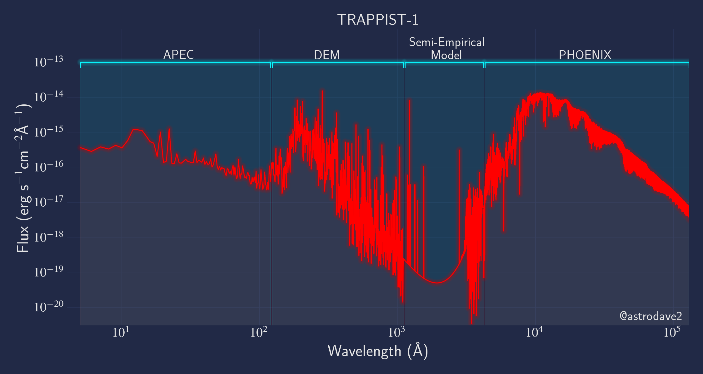

# Trappist-1_MM
Hello! The Mega-MUSCLES SEDs will soon be available [here](https://archive.stsci.edu/prepds/muscles/), but if you want to get started here is the semi-empirical model of Trappist-1. The model has two versions: "const_res" is binned to 1A, whilst "var_res" keeps whatever resolution the different parts came as. Update: The file got too big for GitHub, so the latest versions are here: 

If you use these SEDs in a scientific publication, please [cite Wilson et al. (2021)](https://arxiv.org/abs/2102.11415) and include a link to the hlsp page. You may also want to read and cite [Duvvuri et al. 2021](https://arxiv.org/abs/2102.08493), which describes the DEM models used in the SED. Also, please let me know what you're doing, if you have any questions or feedback about the SED, and/or if there is anyway I can help with your project: <djwilson394@gmail.com>.  

The plot was made using the excellent [mplcyberpunk package](https://github.com/dhaitz/mplcyberpunk)
